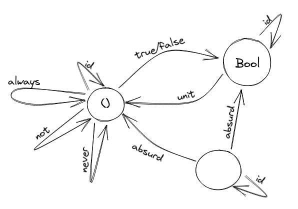

1. Define a higher-order function (or a function object) memoize in your favorite language. This function takes a pure function f as an argument and returns a function that behaves almost exactly like f, except that it only calls the original function once for every argument, stores the result internally, and subsequently returns this stored result every time it’s called with the same argument. You can tell the memoized function from the original by watching its performance. For instance, try to memoize a function that takes a long time to evaluate. You’ll have to wait for the result the first time you call it, but on subsequent calls, with the same argument, you should get the result immediately.

```python
def memoize_func(f):
    calls = {}

    def memoized(x):
        if x not in calls:
            calls[x] = f(x)
        return calls[x]
    
    return memoized
```

2. Try to memoize a function from your standard library that you normally use to produce random numbers. Does it work?

No, because the function isn't pure. `random` works on some kind of internal state and has side-effects which makes it not-pure. And if it did produce the same results everytime, then the essense of `random` is defeated.

3. Most random number generators can be initialized with a seed. Implement a function that takes a seed, calls the random number generator with that seed, and returns the result. Memoize that function. Does it work?

```python
import random
def random_with_seed(seed):
    random.seed(seed)
    return random.random

memoized_random = memoize_func(random_with_seed)

assert memoized_random(0) == memoized_random(0)
assert memoized_random(0) != memoized_random(1)
```

4. Which of these C++ functions are pure? Try to memoize them and observe what happens when you call them multiple times: memoized and not.

(a) The factorial function from the example in the text. - pure function

(b) std::getchar() - not pure since side-effects

(c) 
```cpp
bool f() {
    std::cout << "Hello!" << std::endl;
    return true;
}
```
- side effect of printing

(d)
```cpp
int f(int x) {
    static int y = 0;
    y += x;
    return y;
}
```
- not pure since state may change for `y` var

5. How many different functions are there from Bool to Bool? Can you implement them all?

2 X 2
```Haskell
alwaysTrue :: Bool -> Bool
alwaysTrue _ = True

alwaysFalse :: Bool -> Bool
alwaysFalse _ = False

same :: Bool -> Bool
same trueOrFalse = trueOrFalse

opposite :: Bool -> Bool
opposite trueOrFalse = not trueOrFalse
```
6. Draw a picture of a category whose only objects are the types Void, () (unit), and Bool; with arrows corresponding to all possible functions between these types. Label the arrows with the names of the functions.

